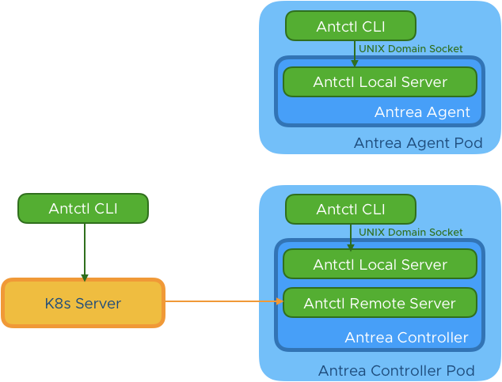
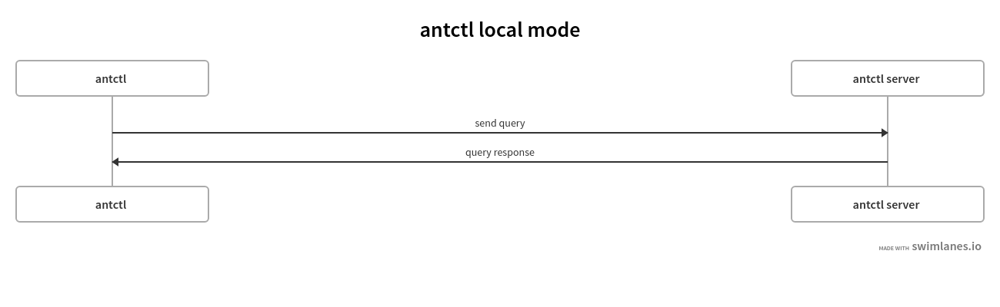
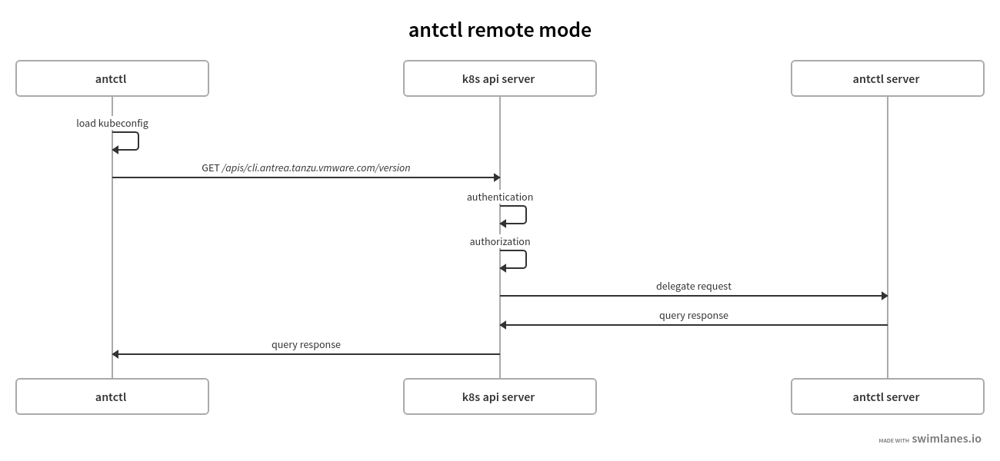

# Antctl

## Overview
Antctl is the command-line tool for antrea that supports querying status and
setting configuration of the controller or agents. The diagram below shows
the overview architecture of antctl.

 

Each command executed by antctl CLI will issue a request to the corresponding antctl
server. Antctl CLI has two execution modes: local mode and remote mode. Both antrea agent and
antrea controller support local mode, and only the antrea controller supports remote mode.

### Local mode
When antctl CLI is running in the pod of any antrea component (agent or controller), 
it is running in local mode. In local mode, antctl CLI will request the local antctl server
via a UNIX domain socket (`/var/run/antctl.sock`), and there is no authentication
or authorization in this mode.


### Remote mode
When antctl CLI is executed outside of the cluster, it is running in remote mode. When running
in remote mode, the antctl client will issue command requests to the Kubernetes apiserver,
then the Kubernetes APIServer will redirect requests to the antrea controller APIServer.
The Kubernetes APIServer will also delegate authorization and authentication (AA). Thus users
need to provide a valid kubeconfig to the antctl CLI in remote mode to pass the AA. 


For different components, antctl provides different commands.

For antrea agent, antctl provides commands:

**command**|**description**
----|----
version|Print versions of the agent and antctl


For antrea controller, antctl provides commands:

**command**|**description**
----|----
version|Print versions of the controller and antctl

More details of these commands can be found by running `antctl help`.

## How to implement a new command

To implement a new command for antctl, developers need to:
 
1. Implement the handler factory in `pkg/antctl/handlers`

```go
func (c *Foo) Handler(aq monitor.AgentQuerier, cq monitor.ControllerQuerier) http.HandlerFunc {
	return func(w http.ResponseWriter, r *http.Request) {
        ...
	}
}
```
The handler function can tell out the component it is running in by checking nullable of the `monitor.AgentQuerier` and `monitor.ControllerQuerier`.
It is running in an antrea agent if the `monitor.AgentQuerier` is not nil or it is running in an antrea controller if the `monitor.ControllerQuerier` is not nil. The server implementation garantees either `monitor.AgentQuerier` or `monitor.ControllerQuerier` is not nil. 

2. Defines the response struct for the command

3. Add a new `commandDefinition` for the new command to the `CommandList` in `pkg/antctl/antctl.go`.

Developers can find the details of the definition struct by checking code comments in `pkg/antctl/commanddefinition.go`.
