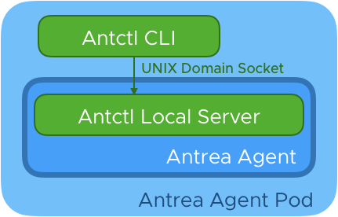

# Antctl

## Overview

Antctl is the command-line tool for antrea that supports querying status of antrea
components. It can run in two modes: agent mode and controller mode.

### Agent Mode

When executing antctl in the pod of antrea-agent, the antctl is in agent mode.
In this mode, the antctl issues requests to the antctl server which is running
alongside with the antrea agent. Since only the agent mode antctl will communicate
with the antctl server, the server listens on a local unix domain socket.



### Controller Mode

When users executing antctl in anywhere but not antrea agent pod, the antctl is
in controller mode. The antctl will issues requests to the k8s API server. Since the
antctl needs to communicate with k8s API server, users should provide a kubeconfig
file which has essential RBAC.


## Commands

For different components, antctl provides different commands.

For antrea agent, antctl provides commands:

**command**|**description**
:----|:----:
version|Print versions of the agent and antctl


For antrea controller, antctl provides commands:

**command**|**description**
----|:----:
version|Print versions of the controller and antctl

More details of these commands can be found by running `antctl help`.

## How to implement a new command


To implement a new command for antctl, developers need to:

1. Implement the handler factory in `pkg/antctl/handlers`

```go
func (c *Foo) Handler(aq monitor.AgentQuerier, cq monitor.ControllerQuerier) http.HandlerFunc {
	return func(w http.ResponseWriter, r *http.Request) {
        ...
	}
}
```
The handler function can tell out the component it is running in by checking nullable of the `monitor.AgentQuerier` and `monitor.ControllerQuerier`.
It is running in an antrea agent if the `monitor.AgentQuerier` is not nil or it is running in an antrea controller if the `monitor.ControllerQuerier` is not nil. The server implementation garantees either `monitor.AgentQuerier` or `monitor.ControllerQuerier` is not nil. 

2. Defines the response struct for the command

3. Add a new `commandDefinition` for the new command to the `CommandList` in `pkg/antctl/antctl.go`.

Developers can find the details of the definition struct by checking code comments in `pkg/antctl/commanddefinition.go`.
